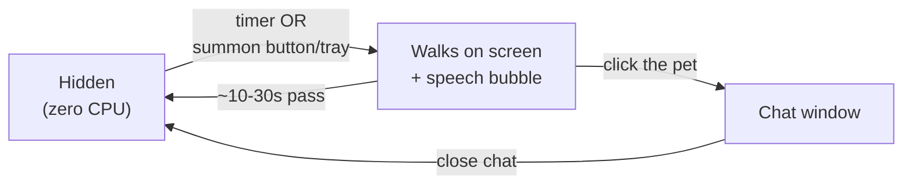
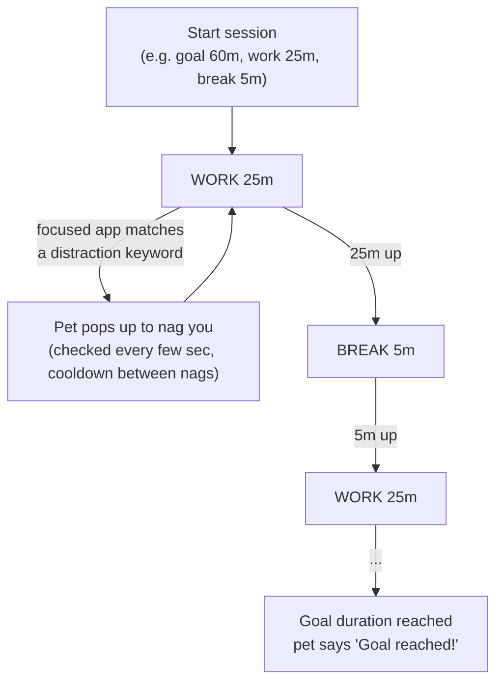

# Desktop Pet

A tiny animated companion that lives on top of your screen. It
walks on-screen every few minutes to check in on you, reminds you to drink
water, wanders around when it feels like it, and can chat with you (offline
by default, or with a real LLM behind an OpenAI key). Everything runs
locally on your own machine: no server, no telemetry, no account.

<p align="center">
  
  &nbsp;&nbsp;&nbsp;
  
</p>
<p align="center"><sub>The pet itself, and the round summon button (bottom-right of your screen by default) that brings it out or sends it away.</sub></p>

Add a GIF or screenshot of the pet walking on screen and the chat bubble
here before sharing this repo. It's the single best thing to lead with.

### How it flows, at a glance



---

## Table of contents

- [Features](#features)
- [Quick start](#quick-start)
- [Using it](#using-it)
- [Study goal (pomodoro)](#study-goal-pomodoro)
- [Chat modes](#chat-modes)
- [Installing and uninstalling](#installing-and-uninstalling)
- [Troubleshooting](#troubleshooting)
- [For developers](#for-developers) (technical highlights, packaging, customization, project structure)

---

## Features

- **Scheduled visits.** Walks in from off-screen on a timer, says a short
  friendly line in a speech bubble, then walks back off. Frequency,
  check-ins, and quiet hours are all configurable.
- **Water/break reminders** on their own independent timer.
- **Study goal (pomodoro).** Set a goal duration split into work/break
  intervals; the pet nags you if your focused app matches a distraction
  keyword during a work interval. [Details below](#study-goal-pomodoro).
- **Idle wandering.** Occasionally pops out just to fidget around and
  leave, no message, just personality.
- **Chat.** Click the character to open a small chat window beside it.
  Works fully offline with built-in canned replies, or can be switched to
  real AI conversation (OpenAI) with one toggle.
- **Multi-monitor aware.** Visits and drag-to-reposition both track
  whichever monitor you're actually using, including mixed-DPI setups
  (a 150%-scaled laptop screen next to a 100% external monitor, for
  example).
- **True desktop overlay.** The window is transparent, frameless, and
  click-through outside of the character itself, so it never blocks
  clicks to your desktop or other apps.
- **Privacy-respecting.** Everything (settings, chat) is local. If you
  turn on AI chat, your API key is encrypted at rest using your OS's own
  secure storage (Keychain, Credential Manager, or libsecret), never
  stored in plain text.
- **Fully configurable without touching code.** Pet size, animation
  speed, sound, always-on-top, visit frequency, personality/system prompt,
  and every line the pet can say are all editable JSON/settings.
- **Packageable into a single .exe/.app.** No Node.js or terminal
  required for the person actually using it.

## Quick start

You need Node.js installed once (this is what runs the app):

1. Go to **https://nodejs.org**, download and install the LTS version.
2. Restart your computer if you just installed it for the first time.

Then:

- **Windows:** double-click `launch.bat`
- **Mac:** double-click `launch.command` (the first time, right-click and
  choose Open to get past Gatekeeper's "unidentified developer" warning)

The first launch installs dependencies, which takes about a minute. After
that it starts instantly. A small window flashes briefly, that's normal,
then the pet lives in the system tray or menu bar.

You'll see:
- A little summon button near the bottom-right of your screen. Drag it
  anywhere, even onto a second monitor.
- A tray icon with a right-click menu: Summon Pet, Chat, Settings, Pause
  Pet, Quit.

The pet itself stays hidden (not just invisible, not rendering at all)
whenever it's not actively visiting, so it costs effectively zero CPU in
the background.

## Using it

- Every 5 minutes by default, the pet walks on-screen, says something,
  and leaves 10 to 30 seconds later. Change this in Settings.
- Click the summon button (or tray, "Summon Pet") to bring it out any
  time, or send it away early if it's already out.
- Click the pet itself to open the chat window.
- Water reminders run on their own separate timer (Settings).
- Pause Pet (tray menu) pauses for 30 minutes, 1 hour, or until tomorrow.
  Manual summon still works while paused.
- Settings covers visit/water frequency, check-ins, sound, animation
  speed, pet size, AI chat and API key, launch-at-startup, always-on-top,
  the floating summon button (can be turned off if it's in the way; the
  tray menu's "Summon Pet" always works either way), and quiet hours.

### If the pet or summon button ever disappears off-screen

Double-click the recovery launcher:

- **Windows:** `bring-pet-on-screen.bat`
- **Mac:** `bring-pet-on-screen.command`

It snaps the summon button back into view (on whichever monitor your
mouse is on) and brings the pet out. If the app is already running, it
just pops back into view instead of opening a second copy, since it's
single-instance locked.

## Study goal (pomodoro)

In **Settings → Study goal**: set a total goal duration split into
work/break intervals. While a work interval is running, the pet checks
your focused app/window every few seconds, and pops up to nag you if it
matches one of your **distraction keywords** (e.g. `youtube, netflix,
discord`).



> **Mac note:** matching a browser tab's title (so it can catch "tiktok"
> or "netflix" open in a browser, not just the native app) needs the
> Automation permission described in [Troubleshooting](#troubleshooting).

## Chat modes

**Basic mode** (default) is fully offline, with canned but friendly
replies and zero setup.

**AI mode** gives you a real conversation via OpenAI's API:

1. Get an API key from https://platform.openai.com/api-keys
2. In Settings, paste it under "OpenAI API key" and click Save key
3. Turn on AI chat mode

The key is encrypted using your OS's own secure storage and never
touches disk in plain text. If AI mode fails for any reason, that
message quietly falls back to basic mode instead of erroring out.

The pet's personality and system prompt live in
[config/personality.json](config/personality.json). Visit messages and
offline chat replies live in [config/messages.json](config/messages.json).
Edit either and restart the app to see the change, no coding required.

## Installing and uninstalling

Already-built installers live in the `dist/` folder after running
`pnpm run dist` (see [For developers](#for-developers) if you need to
build them yourself).

### Windows

- **`Desktop Pet Setup 1.0.0.exe`** — double-click, follow the installer
  (you can pick the install folder), then launch from the Start Menu or
  the Desktop shortcut it creates.
- **`Desktop Pet 1.0.0.exe`** (portable) — no installer, just double-click
  it directly (works fine from a USB stick too).

To uninstall: if you used the Setup installer, go to **Settings → Apps →
Desktop Pet → Uninstall** (or Control Panel → Programs and Features). If
you used the portable `.exe`, just delete that file, nothing else was
installed.

### Mac

1. Double-click the generated **`Desktop Pet-1.0.0-arm64.dmg`** (or
   `-x64.dmg` on an Intel Mac).
2. A Finder window opens showing the app icon and an Applications shortcut,
   drag the app onto **Applications**.
3. First launch: since this build isn't signed with a paid Apple Developer
   certificate, Gatekeeper will likely block it ("Desktop Pet is damaged"
   or "unidentified developer"). Right-click the app in Applications →
   **Open** → **Open** again in the dialog, or go to **System Settings →
   Privacy & Security** and click **Open Anyway** next to the warning.

To uninstall: quit the app first (tray icon → Quit), then open
**Applications**, find **Desktop Pet**, and drag it to the Trash (or
right-click → Move to Trash) — there's no separate uninstaller. If you
also want to remove its saved settings/study-goal config, delete
`~/Library/Application Support/desktop-pet` as well.

### Linux

- `chmod +x "Desktop Pet-1.0.0.AppImage"` once, then double-click or run
  it directly. No install step.
- To uninstall, just delete that file (and `~/.config/desktop-pet` if you
  want to remove saved settings too).

## Troubleshooting

- **"node" is not recognized / command not found.** Node.js isn't
  installed, or you need to restart your computer after installing it.
- **npm install fails.** Check your internet connection, and delete
  `node_modules` and retry if it gets stuck partway.
- **Pet or button missing.** Use `bring-pet-on-screen.bat`/`.command`.
- **Nothing happens double-clicking on Mac.** Right-click the file and
  choose Open the first time, to get past Gatekeeper's warning.
- **Study goal distraction check does nothing on Mac.** It needs
  permission to read the frontmost app/window title via System Events.
  The first check should trigger a macOS prompt asking to let Desktop Pet
  control "System Events" — click OK. If you dismissed it, or it never
  showed, grant it manually in **System Settings → Privacy & Security →
  Automation → Desktop Pet → System Events**. Without this permission,
  keyword matches still work against native apps' process names (e.g.
  Discord, Steam), just not against a browser tab's title (e.g. catching
  "tiktok" or "netflix" open in a browser).

## For developers

<details>
<summary>Technical highlights</summary>

- **Frameless, transparent, click-through windows** — a borderless
  `BrowserWindow` sized to the sprite, with `setIgnoreMouseEvents()`
  toggled live so the desktop underneath stays clickable everywhere else.
- **Window-bounds animation synced with CSS** — OS windows can't be
  animated with CSS, so walk/enter/leave is a hand-rolled tween loop
  (`animateBounds()` in [main.js](main.js)) timed to match the renderer's
  CSS transitions (e.g. the bubble fade), otherwise the two visibly fight.
- **Multi-monitor / mixed-DPI correct** — dragging the summon button and
  placing visits both resolve against `screen.getCursorScreenPoint()` /
  the focused window's monitor in the main process, since a renderer's
  `MouseEvent.screenX/Y` breaks across differently-scaled monitors.
- **Offline-first chat** — a local reply engine by default; AI mode calls
  OpenAI and transparently falls back to offline replies on any failure.
- **Secrets handled properly** — the OpenAI API key is encrypted with
  Electron's `safeStorage` (OS keychain-backed), never written to disk in
  plain text.

</details>

<details>
<summary>Packaging it yourself</summary>

No Node.js, no terminal, no `launch.bat`, just a normal
double-click-to-run app:

```
pnpm install
pnpm run dist:win
```

Look in the generated `dist/` folder for:

- `Desktop Pet Setup 1.0.0.exe`, a real installer with a Start
  Menu/Desktop shortcut that installs to `%LOCALAPPDATA%`.
- `Desktop Pet 1.0.0.exe`, a portable single file with no install step.

`pnpm run dist` builds a .dmg or AppImage on Mac/Linux the same way. This
project uses [pnpm](https://pnpm.io) (not npm); install it once with
`npm install -g pnpm` or `corepack enable` if you don't have it yet.

</details>

<details>
<summary>Customization</summary>

**Swap the character art.** One expression/pose sprite per mood in
`assets/sprites/cat/*.png` (see the `MOOD_SPRITES` map in `main.js`), each
cropped onto the same 331:422 canvas (see `SPRITE_ASPECT` in
[lib/petSizes.js](lib/petSizes.js)) so switching mood never changes the
window's aspect ratio. The art is original, self-generated artwork (not
stock or third-party assets), cut from a single sprite sheet and
background-removed with a small Python script. To swap it: replace the
`.png` files directly (keep the same filenames and aspect ratio). The
tray/summon/app icons are then regenerated from `greeting.png` by
[scripts/generate_icons.py](scripts/generate_icons.py) (`python3
scripts/generate_icons.py`, requires Pillow: `pip install pillow`).

**Move to a real sprite sheet or frame-by-frame animation later.**
Animation logic is centralized in [renderer/pet/pet.js](renderer/pet/pet.js)
(walk/idle/bubble state machine), [renderer/pet/pet.css](renderer/pet/pet.css)
(CSS transforms), and [lib/petSizes.js](lib/petSizes.js) (sizing shared
between main process and CSS). Swapping `` for an
animated component is the natural next step.

**Change what it says or how it talks.**
[config/messages.json](config/messages.json) and
[config/personality.json](config/personality.json) — edit and restart
the app, no coding required.

</details>

<details>
<summary>Project structure</summary>

```
desktop-pet/
  main.js                  Electron main process: windows, scheduling, tray, IPC
  preload.js                Safe bridge exposing window.api to each renderer
  store.js                  Local JSON settings persistence
  lib/
    basicChat.js             Offline chat reply engine
    ai.js                     OpenAI API call for AI chat mode
    activeWindow.js           Foreground app/window lookup (Windows + macOS)
    studySession.js           Pomodoro work/break state machine
    petSizes.js               Shared sizing constants
  config/
    personality.json          Editable AI personality/system prompt
    messages.json              Editable visit messages + offline chat replies
  renderer/
    pet/                       The transparent always-on-top pet window
    summon/                    The draggable summon button window
    chat/                      The compact chat window
    settings/                  The settings screen
  assets/
    sprites/cat/*.png            Cat mascot art, one expression/pose per mood
    icons/                      Tray / summon button / app icons
    sounds/chime.wav             Small notification chime
  scripts/
    generate_icons.py               Regenerates every tray/app icon from greeting.png (needs Pillow)
  launch.bat / launch.command                   Everyday launcher
  bring-pet-on-screen.bat / .command             Recovery launcher
```

**How it behaves under the hood:**

- The pet window is transparent and frameless; only the character (and
  briefly its speech bubble) is ever visible, no rectangular app window.
- It's hidden entirely (not just invisible) whenever it's not actively
  visiting, keeping background CPU usage effectively zero.
- Settings are saved locally in your OS's standard app data folder. Chat
  history is intentionally not saved; it resets each time you reopen the
  chat window.

</details>

---

Built with Electron. Personal project, contributions and forks are welcome. ❤️
